# 📦 PRD: SaaS Agent Pipeline (Data B2B)
## División de Funciones: Antigravity (Frontend) + Claude (Backend)

---

## 🎯 Producto
**Una fábrica de leads B2B para LatAm.** El usuario (agencia/vendedor) obtiene leads de dos formas:

1. **📦 Paquetes Pre-armados** — Listas listas por sector (Inmobiliarias Lima, Clínicas CDMX, etc.). Compra y descarga al instante.
2. **🎯 Pedido Custom (On-Demand)** — El usuario dice: Dame los comentaristas de @clinica_rival que preguntaron 'precio' en los últimos 30 días. Entrega en 48h.

---

## 🏗️ Tech Stack

| Capa | Tecnología | Quién lo arma |
|------|-----------|---------------|
| **Frontend** | Vite + React + Stitch (UI) | **Antigravity** |
| **Backend API** | Python FastAPI | **Claude** |
| **Scraping** | Apify Actors + Proxies | **Claude** |
| **Base de Datos** | Supabase (PostgreSQL) | **Claude** |
| **Auth** | Supabase Auth | **Claude** |
| **Pagos** | Stripe / Mercado Pago | **Claude** |
| **Storage** | Supabase Storage (CSVs) | **Claude** |

---

## 👥 User Stories (MVP)

| # | Como... | Quiero... | Para... |
|---|---------|-----------|---------|
| US-1 | Gerente de Ventas | Ver un catálogo de paquetes de leads por sector | Elegir qué lista comprar al instante |
| US-2 | Gerente de Ventas | Pagar con tarjeta o Mercado Pago | Obtener mi lista al instante |
| US-3 | Gerente de Ventas | Descargar un CSV con nombre, teléfono, email, fuente | Importarlo a mi CRM/WhatsApp |
| US-4 | Gerente de Ventas | **Pedir un extracto custom** de una cuenta de IG/TikTok específica | Obtener leads hiper-relevantes de mi competidor directo |
| US-5 | Admin (tú) | Subir listas generadas por los agentes | Que estén disponibles para venta |
| US-6 | Admin (tú) | Ver dashboard de ventas, descargas y pedidos custom | Saber qué se vende y qué pedidos están pendientes |

---

## 📐 Screens (Frontend — Antigravity + Stitch)

### Screen 1: Landing Page / Home
- Hero: Leads B2B verificados para LatAm. Descarga tu lista en 5 minutos.
- Catálogo de paquetes por sector (cards con precio, cantidad, preview)
- Social proof: 2,300 leads entregados este mes
- CTA: Ver Paquetes

### Screen 2: Catálogo de Paquetes
- Filtros: País, Sector, Tamaño de lista
- Cards: Nombre del paquete, descripción, # de leads, precio, botón Comprar
- Preview: Muestra 5 leads de ejemplo (borrosos/parciales)

### Screen 3: Checkout
- Resumen del pedido
- Formulario de pago (Stripe/MP embed)
- Botón Pagar y Descargar

### Screen 4: Custom Request (On-Demand) 🆕
- Formulario: ¿Qué cuenta de IG/TikTok quieres monitorear?
- Campo: URL de la cuenta objetivo
- Campo: Tipo de dato (Comentaristas, Likers, Seguidores)
- Campo: Filtro de keywords (precio, envío, cita, etc.)
- Precio dinámico según volumen estimado
- CTA: Pedir mi Lista Custom ($X)
- Status tracker: Procesando → Listo para descargar

### Screen 5: Dashboard (Post-compra)
- Historial de compras (paquetes + custom)
- Links de descarga (CSV)
- Estado de pedidos custom (En proceso, Listo)

### Screen 6: Admin Panel (Solo tú)
- Subir nuevas listas (CSV upload)
- Crear paquetes (nombre, sector, país, precio, archivo)
- **Cola de pedidos custom** (ver, procesar, entregar)
- Ver métricas de venta

---

## 🔌 API Endpoints (Backend — Claude)

### Auth
| Método | Ruta | Descripción |
|--------|------|-------------|
| POST | `/api/auth/register` | Registro con email |
| POST | `/api/auth/login` | Login, retorna JWT |

### Paquetes (Público)
| Método | Ruta | Descripción |
|--------|------|-------------|
| GET | `/api/packages` | Listar paquetes disponibles (filtros: país, sector) |
| GET | `/api/packages/:id` | Detalle de un paquete + preview de 5 leads |

### Compras (Autenticado)
| Método | Ruta | Descripción |
|--------|------|-------------|
| POST | `/api/checkout` | Crear sesión de pago (Stripe/MP) |
| POST | `/api/webhook/payment` | Webhook de confirmación de pago |
| GET | `/api/purchases` | Historial de compras del usuario |
| GET | `/api/purchases/:id/download` | Generar link temporal de descarga CSV |

### Custom Requests (Autenticado)
| Método | Ruta | Descripción |
|--------|------|-------------|
| POST | `/api/custom-requests` | Crear pedido custom (cuenta IG + filtros) |
| GET | `/api/custom-requests` | Listar mis pedidos custom |
| GET | `/api/custom-requests/:id` | Estado + descarga del pedido |

### Admin (Solo Admin)
| Método | Ruta | Descripción |
|--------|------|-------------|
| POST | `/api/admin/packages` | Crear paquete nuevo |
| PUT | `/api/admin/packages/:id` | Editar paquete |
| POST | `/api/admin/packages/:id/upload` | Subir CSV al paquete |
| GET | `/api/admin/custom-requests` | Ver cola de pedidos custom pendientes |
| PUT | `/api/admin/custom-requests/:id/deliver` | Marcar pedido como Listo + subir CSV |
| GET | `/api/admin/metrics` | Dashboard de ventas |

### Agentes / Scraping (Interno)
| Método | Ruta | Descripción |
|--------|------|-------------|
| POST | `/api/agents/run` | Lanzar un Apify Actor para generar leads |
| GET | `/api/agents/status/:runId` | Ver estado del scraping |

---

## 📁 Estructura de Carpetas

```
d:\habilidades\agent-pipeline/
├── frontend/                    ← ANTIGRAVITY
│   ├── .stitch/                 ← Diseños con Stitch
│   │   ├── DESIGN.md
│   │   ├── SITE.md
│   │   ├── next-prompt.md
│   │   └── designs/
│   ├── src/
│   │   ├── pages/
│   │   │   ├── Home.jsx
│   │   │   ├── Catalog.jsx
│   │   │   ├── Checkout.jsx
│   │   │   └── Dashboard.jsx
│   │   ├── components/
│   │   │   ├── PackageCard.jsx
│   │   │   ├── LeadPreview.jsx
│   │   │   ├── NavBar.jsx
│   │   │   └── PaymentForm.jsx
│   │   ├── App.jsx
│   │   └── main.jsx
│   ├── public/
│   ├── index.html
│   ├── vite.config.js
│   └── package.json
│
├── backend/                     ← CLAUDE
│   ├── app/
│   │   ├── main.py              ← FastAPI app
│   │   ├── routes/
│   │   │   ├── auth.py
│   │   │   ├── packages.py
│   │   │   ├── checkout.py
│   │   │   └── admin.py
│   │   ├── models/
│   │   │   ├── user.py
│   │   │   ├── package.py
│   │   │   └── purchase.py
│   │   ├── services/
│   │   │   ├── apify_agent.py   ← Orquestador de scraping
│   │   │   ├── payment.py       ← Stripe/MP integration
│   │   │   └── csv_generator.py
│   │   └── config.py
│   ├── requirements.txt
│   └── .env
│
├── shared/
│   └── types.ts                 ← Tipos compartidos
│
└── README.md
```

---

## 🔄 Flujo de Trabajo (Quién hace qué, cuándo)

```mermaid
sequenceDiagram
    participant AG as Antigravity (Frontend)
    participant CL as Claude (Backend)
    
    Note over AG,CL: FASE 1 (Paralelo)
    AG->>AG: Scaffold Vite + React
    AG->>AG: Diseñar con Stitch (Landing, Catálogo)
    CL->>CL: Scaffold FastAPI + Supabase
    CL->>CL: Crear modelos + endpoints de paquetes
    
    Note over AG,CL: FASE 2 (Integración)
    CL->>AG: API lista en /api/packages
    AG->>AG: Conectar Catalog.jsx al API
    CL->>CL: Implementar Stripe/MP checkout
    AG->>AG: Integrar formulario de pago
    
    Note over AG,CL: FASE 3 (Admin + Agentes)
    CL->>CL: Panel admin + upload CSV
    CL->>CL: Integrar Apify actors
    AG->>AG: Dashboard post-compra
```



---

## ✅ Checklist de Arranque

### Antigravity (Frontend) — AHORA
- [ ] Crear carpeta `d:\habilidades\agent-pipeline\frontend`
- [ ] Scaffold: `npx create-vite@latest ./`
- [ ] Configurar `.stitch/` para diseño con Stitch
- [ ] Diseñar Screen 1 (Landing) con Stitch
- [ ] Diseñar Screen 2 (Catálogo) con Stitch

### Claude (Backend) — DESPUÉS
- [ ] Crear carpeta `d:\habilidades\agent-pipeline\backend`
- [ ] Scaffold: FastAPI + Supabase client
- [ ] Crear modelos: User, Package, Purchase
- [ ] Implementar `GET /api/packages` y `GET /api/packages/:id`
- [ ] Configurar Supabase Auth

